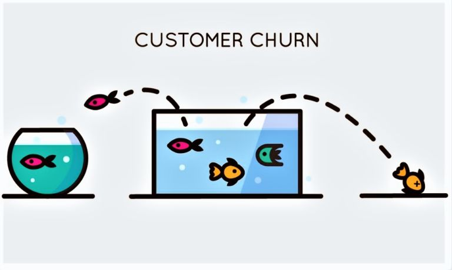
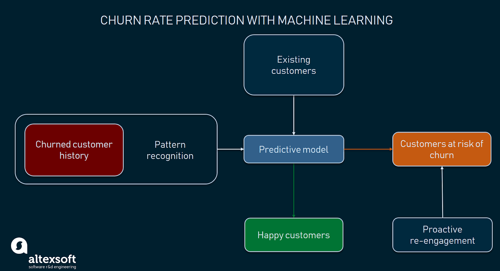

#  Churn Modeling

#### Project Overview

##### Introduction

Churn (aka customer attrition) is a scourge on subscription businesses. When your revenue is based on recurring monthly or annual contracts, every customer who leaves puts a dent in your cash flow. High retention rates are vital for your survival.

So what if we told you there was a way to predict, at least to some degree, how and when your customers will cancel?

That’s exactly what a churn model can do.

Building a predictive churn model helps you make proactive changes to your retention efforts that drive down churn rates. Understanding how churn impacts your current revenue goals and making predictions about how to manage those issues in the future also helps you stem the flow of churned customers. If you don’t take action against your churn now, any company growth you experience simply won’t be sustainable.

#### Project Goals

Identifying at-risk customers with machine learning

#### Data Overview

Dataset is from Kaggle. The dataset is the details of the employees in a company.The column are about it's estimated salary, age, sex, etc. Aiming to provide all details about an employee.
##### Attributes Information

Input variables (based on physicochemical tests):
1.  CreditScore
2.  Geography
3.  Gender
4.  Age
5.  Tenure
6.  Balance      
7.  NumOfProducts
8.  HasCrCard
9.  IsActiveMember
10. EstimatedSalary
11  Exited

